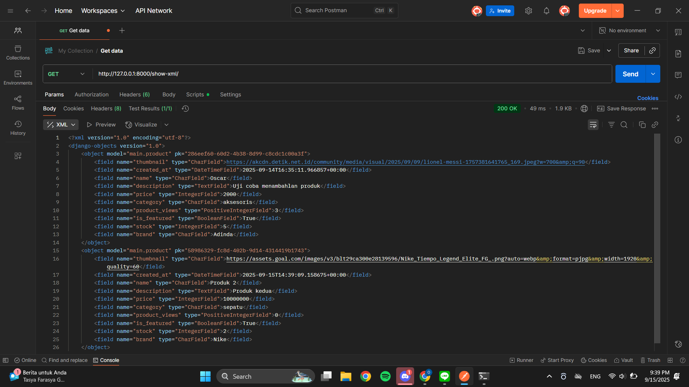
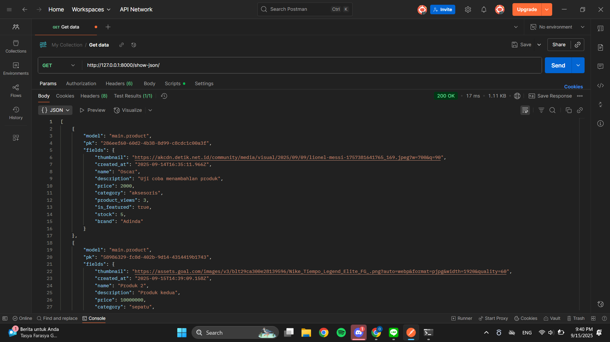
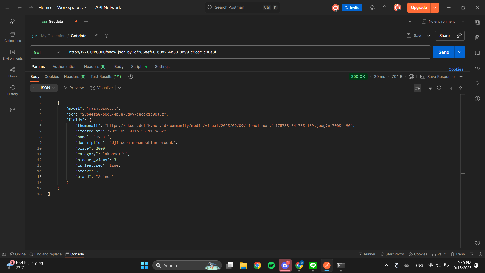

# [Kick Season](https://oscar-glad-kickseason.pbp.cs.ui.ac.id/)

## TUGAS 2

### 1. Jelaskan bagaimana cara kamu mengimplementasikan checklist di atas secara step-by-step!
Jawab :
Berikut adalah langkah-langkah yang saya lakukan untuk menyelesaikan seluruh checklist pada tugas 2.
- Membuat direktori lokal, inisiasi git, lalu menghubungkan direktori lokal dengan repo git
- Mengaktifkan virtual environment
- Menyiapkan dependencies di dalam file requirements.txt, lalu menginstall depedencies tersebut
- Membuat project django bernama kick season (nama football shop yang saya buat)
- Membuat file .env dan mengatur konfigurasi production menjadi false
- Membuat file .env.prod -> mengatur schema menjadi tugas_individu, meng-set production menjadi true, dan memasukkan kredensial database (nanti akan digunakan untuk production deployment)
- Melakukan konfigurasi pada file settings.py (environment varaiable, daftar host, production, dan database)
- Membuat app django bernama main
- Mengatur route pada file urls.py (di level project)
- Membuat model, templates (main.html), serta menghubungkan view dan templates pada app main
- Melakukan migrasi
- Membuat project baru di PWS dan membuat konfigurasi sesuai .env.prod
- Meng-copy link PWS, lalu memasukkan ke daftar host (allowed host)
- Melakukan add, commit, dan push ke repo git dan PWS

### 2. Buatlah bagan yang berisi request client ke web aplikasi berbasis Django beserta responnya dan jelaskan pada bagan tersebut kaitan antara urls.py, views.py, models.py, dan berkas html!
Jawab :
Bagan : [Bagan Request Client](https://drive.google.com/file/d/1a2xNUO2gD6PqS5Qh6Tr2Oq_QnOsDz4aD/view?usp=sharing)
Sumber bagan : [Sumber Bagan](https://pbp-fasilkom-ui.github.io/ganjil-2023/assignments/tutorial/tutorial-1/)

Berdasarkan bagan yang disajikan, request client (request HTTP) akan diterima oleh web aplikasi Django ketika user memasukkan URL pada browser. Kemudian, request tersebut diteruskan ke urls.py untuk mencocokkan alamat URL dan meneruskan ke views.py yang didefinisikan untuk memproses permintaan tersebut. Apabila diperlukan interaksi dengan database, views.py akan memanggil query ke models.py dan database akan mengembalikan hasil ke views.py. Lalu, views.py akan memilih dan mengatur tampilan dengan menggunakan template (file html) yang sesuai, lalu dikirimkan kembali ke user sebagai HTTP response yang dapat dilihat melalui browser mereka.

### 3. Jelaskan peran settings.py dalam proyek Django!
Settings.py berfungsi sebagai file yang menyimpan semua konfigurasi project django yang kita buat. Beberapa hal yang dapat dikonfigurasi antara lain:
- Daftar aplikasi (di bagian INSTALLED_APPS)
- Daftar host (di bagian ALLOWED HOST)
- Database
- Static file -> mengatur lokasi file statis seperti CSS, Javascript
- Middleware
- Template
Selain itu, settings.py juga digunakan untuk menyimpan informasi rahasia seperti secret key.

### 4. Bagaimana cara kerja migrasi database di Django?
Django menggunakan sistem migrasi berbasis file. Artinya, setiap perubahan yang kita buat pada model akan menghasilkan file migrations. File tersebut mencatat apa saja hal yang perlu diubah pada struktur database. Ketika kita menjalankan perintah manage.py makemigrations, kita akan memperoleh file yang merepresentasikan perubahan pada model. Lalu, kita jalankan perintah manage.py migrate untuk menjalankan semua perubahan yang tercantum pada file migrasi.
Referensi : [Referensi Migrasi Database pada Django](https://blog.unmaha.ac.id/migrasi-database-django-langkah-langkah-yang-benar-untuk-pengembangan-tanpa-masalah/)

### 5. Menurut Anda, dari semua framework yang ada, mengapa framework Django dijadikan permulaan pembelajaran pengembangan perangkat lunak?
Jawab : Menurut saya, Django dijadikan permulaan pembelajaran perangkat lunak karena memiliki dokumentasi yang lengkap. Lalu, Django juga dipilih karena memiliki fitur-fitur bawaan yang lengkap, seperti administrasi yang kuat, sistem autentikasi user, URL map, template engine, dan dukungan ORM (Object-Relational Mapping) untuk memudahkan interaksi dengan database menggunakan Python. Terakhir, Django juga memiliki sistem kemanan built-in yang cukup baik.

### 6. Apakah ada feedback untuk asisten dosen tutorial 1 yang telah kamu kerjakan sebelumnya?
Jawab :
Saya senang dengan kinerja asisten dosen pada tutorial 1 karena selalu siap membantu mahasiswa yang mengalami kesulitan atau kendala, sehingga proses tutorial yang berjalan secara online terasa mudah dan berjalan lancar.

## TUGAS 3
### 1. Jelaskan mengapa kita memerlukan data delivery dalam pengimplementasian sebuah platform?
Jawab : Data delivery diperlukan agar data yang telah dimiliki dapat tersampaikan ke client atau sistem lainnya secara cepat, akurat, dan aman melalui metode seperti XML dan JSON. Salah satu contohnya adalah mengirimkan context ke file template HTML untuk kemudian di-render dan ditampilkan ke user.

### 2. Menurutmu, mana yang lebih baik antara XML dan JSON? Mengapa JSON lebih populer dibandingkan XML?
Jawab : Menurut saya JSON lebih baik karena memiliki kemudahan dalam hal parsing. Mungkin hal ini juga yang membuat JSON lebih populer dibandingkan XML, dimana JSON dapat diparsing secara langsung oleh JavaScript (bahasa yang umum digunakan untuk membuat web), sementara XML membutuhkan parser khusus yang membuat parsing sedikit lebih panjang. Selain itu, JSON juga memiliki struktur yang lebih mudah untuk dibaca manusia karena pasangan key dan value disajikan dengan jelas, berbeda dengan XML yang agak rumit dibaca karena menggunakan banyak tag.

### 3. Jelaskan fungsi dari method is_valid() pada form Django dan mengapa kita membutuhkan method tersebut?
Jawab : Method_is_valid pada form berfungsi untuk memeriksa dan memastikan bahwa semua field yang diisi oleh user sudah sesuai dengan tipe data dan aturan yang di-inisiasi pada file model. Method ini diperlukan agar tidak sembarang input dari user tidak langsung disimpan ke database.

### 4. Mengapa kita membutuhkan csrf_token saat membuat form di Django? Apa yang dapat terjadi jika kita tidak menambahkan csrf_token pada form Django? Bagaimana hal tersebut dapat dimanfaatkan oleh penyerang?
Jawab : Token CSRF dibutuhkan saat membuat form untuk mencegah terjadinya serangan CSRF. Token ini akan dibuat oleh django untuk memastikan bahwa request benar-benar berasal dari user yang mengakses website kita, bukan dari pihak lain yang tidak terpercaya. Jika tidak menambahkan csrf_token pada Django, form bisa saja menerima input dari sumber yang tidak aman. Ketiadaan csrf_django dapat dimanfaatkan oleh penyerang untuk membuat form palsu, kemudian mengirimkan requestnya ke web kita dan web akan menganggap request tersebut berasal dari user yang sah. Aksi tersebut bisa saja dimanfaatkan oleh penyerang untuk melakukan hal-hal yang tidak diinginkan.

### 5. Jelaskan bagaimana cara kamu mengimplementasikan checklist di atas secara step-by-step (bukan hanya sekadar mengikuti tutorial).
Jawab : 
- Membuat directory template di root dan mengisinya dengan base.html (agar file html nya konsisten)
- Mengubah aturan templates pada settings.py agar base html dapat diterapkan
- Menerapkan base.html ke seluruh file HTML
- Membuat 6 function di views.py untuk menangani pembuatan produk, melihat detail produk, melihat XML, melihat JSON, melihat XML  berdasarkan ID, dan melihat JSON berdasarkan ID
- Mengatur route keenam function tersebut pada file urls.py
- Membuat file html yang berfungsi untuk membuat dan menampilkan detail produk, kemudian memasukkan nama file HTML ke render yg - ada di views.py (base.html juga diterapkan di file HTML ini)
- Mencoba runserver di lokal untuk memastikan semua berjalan sesuai harapan
- Setelah berjalan sesuai harapan, melakukan commit add push ke Git dan PWS

### 6. Apakah ada feedback untuk asdos di tutorial 2 yang sudah kalian kerjakan?
Jawab : Saya senang dengan kinerja asisten dosen pada tutorial 2 karena dokumen tutorial ditulis dengan jelas. Selain itu, asisten dosen juga selalu siap membantu mahasiswa yang mengalami kesulitan atau kendala, sehingga proses tutorial dapat berjalan lancar.

## Screenshoot hasil postman
### Show XML

### Show JSON

### Show XML by ID

### Show JSON by ID

## TUGAS 4
### 1. Apa itu Django AuthenticationForm? Jelaskan juga kelebihan dan kekurangannya.
Jawab :
Django AuthenticationForm merupakan form bawaan Django yang bisa menangani proses login. Form ini akan meminta username serta password, kemudian melakukan validasi terhadap username dan password, lalu mengembalikan object user yang sesuai. Kelebihan dari Django AuthenticationForm adalah mempercepat developer untuk membuat proses autentikasi serta memiliki keamanan yg cukup baik (karena dia menyimpan passwordnya dengan hash). Sebaliknya, kekurangann Django AuthenticationForm adalah field yang terbatas, belum memungkinkan pengguna untuk login dengan metode selain username dan password.

### 2. Apa perbedaan antara autentikasi dan otorisasi? Bagaiamana Django mengimplementasikan kedua konsep tersebut?
Jawab :
Autentikasi berarti menentukan siapa user tersebut, sedangkan otorisasi berarti menentukan apa akses yang boleh dilakukan oleh user tersebut. Misal, kita login di Scele, kita melalui proses autentikasi, kemudian kita di-otorisasi dan mendapat akses sebagai mahasiswa. Django mengimplementasikan autentikasi ini dengan authenticate() yang berfungsi untuk memeriksa apakah username dan password yang diinput sesuai dengan simpanan di database. Jika sesuai, maka Django akan mengembalikan object user tersebut. Lalu, otorisasi di Django bisa diimplementasikan dengan decorator permission_required yang memungkinkan beberapa fungsi di views.py hanya dapat diakses oleh user dengan permission tertentu.

### 3. Apa saja kelebihan dan kekurangan session dan cookies dalam konteks menyimpan state di aplikasi web?
Jawab :
Cookies
Kelebihan : Disimpan data di sisi client sehingga tidak membebani server

Kekurangan : Ukuran terbatas, bisa menambah beban jaringan, dan rawan terkena XSS

Session
Kelebihan : lebih aman karena tidak disimpan di client side dan ukuran bisa lebih besar

Kekurangan : Butuh space yg berpotensi membebani server

### 4. Apakah penggunaan cookies aman secara default dalam pengembangan web, atau apakah ada risiko potensial yang harus diwaspadai? Bagaimana Django menangani hal tersebut?
Jawab :
Pengunaan cookies tidak sepenuhnya aman karena memiliki risiko keamanan, salah satunya adalah XSS, yaitu vulnerability di mana seseorang
bisa melakukan injeksi kode Javascript yang akan dieksekusi oleh client. XSS ini bisa saja mencuri cookies dari pengguna yang sudah melakukan login ke sebuah website. Salah satu upaya penanganan Django atas risiko keamanan ini adalah dengan HttpOnly yang dapat mencegah akses cookies lewat JavaScript.
Referensi : Slide PBP Pekan 5

### 5. Jelaskan bagaimana cara kamu mengimplementasikan checklist di atas secara step-by-step (bukan hanya sekadar mengikuti tutorial).
Jawab :
1. Membuat fungsi untuk meng-handle proses registrasi, login, dan logout
2. Membuat halaman HTML untuk menampilkan proses registrasi dan login
3. Membuat path di urls.py untuk mengarahkan ke fungsi yang menghandle proses registrasi, login, dan logout
4. Menambahkan field user di models.py
5. Memanfaatkan user untuk membuat filter penampilan product di views.py (jadi bisa menampilkan product yang hanya ditambahkan oleh pengguna tertentu)
6. Mengatur agar fungsi show_main, show_product, dan create_product hanya bisa diakses bila user berhasil login (dengan decorator yang mengarahkan user ke halaman login)
Note : Saya juga mengimplementasikan cookies dengan men-set cookies ketika user berhasil login, kemudian menghapusnya ketika user melakukan logout.

